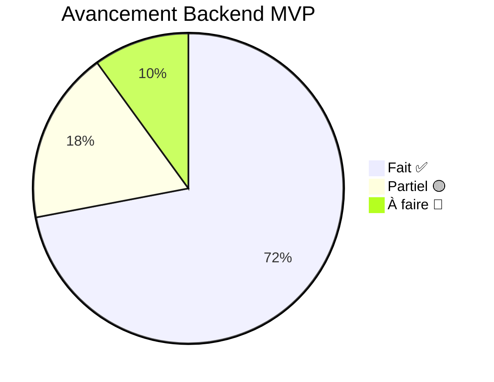

# 📊 Évaluation Backend EduManager vs Cahier des Charges v1.0

> **Date** : 19 avril 2026  
> **Phase ciblée** : Phase 1 — MVP (Mois 1–3, Profil P1)

---

## 🏆 Score Global : **72%** du MVP Backend

---

## 1. Multi-Tenancy

| Exigence | Statut | Détail |
|----------|--------|--------|
| Colonne `tenant_id` sur toutes les tables métier | ✅ Fait | Présent dans le schéma Prisma |
| `tenant_id` extrait du JWT uniquement | ✅ Fait | `TenantMiddleware` décode le JWT |
| Middleware injecte le `tenant_id` | ✅ Fait | `AsyncLocalStorage` + `TenantContext` |
| Injection automatique dans les requêtes Prisma | ✅ Fait | Extension Prisma `$extends` |
| Soft delete uniquement | 🟡 Partiel | Implémenté sur SchoolYears, Classes, Students, Teachers, Subjects. Manque sur Grades et Absences (delete physique) |
| Zéro fuite entre tenants | ✅ Fait | Extension Prisma filtre automatiquement |

**Score section : 90%** ✅

---

## 2. Rôles (RBAC)

| Exigence | Statut | Détail |
|----------|--------|--------|
| 7 rôles définis | ✅ Fait | `RoleEnum` dans le schéma Prisma |
| Guards sur toutes les routes | ✅ Fait | `JwtAuthGuard` + `RolesGuard` appliqués |
| Décorateur `@Roles()` | ✅ Fait | Fonctionne avec les enums Prisma |
| Prof limité à ses `teacher_assignments` | 🔴 À faire | Le guard vérifie le rôle, mais pas l'assignment spécifique |
| Utilisateur `statut=false` bloqué | ✅ Fait | Vérifié dans `AuthService.login()` |
| Parent ne voit que son enfant | 🔴 À faire | Lien parent-enfant non implémenté |

**Score section : 65%** 🟡

---

## 3. Modèle de données (Prisma)

| Table du cahier | Statut | Notes |
|-----------------|--------|-------|
| `tenants` | ✅ | Profil, plan, logo |
| `users` | ✅ | Email unique, rôle, statut |
| `school_years` | ✅ | Statut active/archived |
| `periods` | ✅ | Type (trimestre/semestre/sequence/module) |
| `classes` | ✅ | Niveau, capacité, parent_class_id |
| `subjects` | ✅ | Coefficient, crédits ECTS |
| `teachers` | ✅ | Lié à User, matricule |
| `teacher_assignments` | ✅ | Contrainte d'unicité |
| `students` | ✅ | Matricule, contact parent |
| `grades` | ✅ | Pondération, type évaluation, contrainte unique |
| `absences` | ✅ | Statut, motif |
| `fees` | ✅ | Montant, montant payé, statut |
| `subject_classes` | 🔴 À faire | Table de liaison non créée |
| `report_cards` | 🔴 À faire | Bulletins PDF non implémentés |
| `fee_payments` | 🔴 À faire | Table séparée pour l'historique des paiements |
| `schedules` | 🔴 À faire | Emploi du temps non implémenté |
| `audit_logs` | 🔴 À faire | Journalisation des actions |
| `ects_jury_results` | 🔴 À faire | Phase 4 (P3) |
| `student_ue_choices` | 🔴 À faire | Phase 4 (P3) |

**Score section : 65%** 🟡

---

## 4. Règles métier

| Règle | Statut | Détail |
|-------|--------|--------|
| Une seule année `active` par tenant | ✅ Fait | Transaction dans `SchoolYearsService.create()` |
| Note liée à une période | ✅ Fait | `periodId` obligatoire dans le DTO |
| Pas de note si période clôturée | 🔴 À faire | Vérification non implémentée dans `GradesService` |
| Déverrouillage période par admin seul | 🟡 Partiel | Route `cloturer` existe, mais pas `unlock` |
| Valeur note entre 0 et valeur_max | 🔴 À faire | Validation manquante dans le DTO |
| Prof doit avoir un assignment | 🔴 À faire | Vérification non implémentée |
| Paiement ≤ montant restant dû | ✅ Fait | Vérifié dans `FeesService.pay()` |
| Soft delete élèves | ✅ Fait | `statut: false` |
| Année archivée = lecture seule | 🔴 À faire | Pas de guard sur les années archivées |

**Score section : 45%** 🟡

---

## 5. API REST

| Groupe de routes | Statut | Routes implémentées |
|------------------|--------|---------------------|
| Auth | 🟡 Partiel | `POST /login` ✅ — `logout`, `refresh`, `forgot-password` 🔴 |
| Users | 🟡 Partiel | `findByEmail` ✅ — CRUD complet 🔴, import 🔴 |
| School Years | ✅ Fait | CRUD + activate |
| Periods | ✅ Fait | CRUD + cloturer |
| Classes | ✅ Fait | CRUD + filtre par année |
| Subjects | ✅ Fait | CRUD |
| Teachers | ✅ Fait | CRUD |
| Teacher Assignments | ✅ Fait | Create + List + Delete |
| Students | ✅ Fait | CRUD + filtres — import 🔴 |
| Grades | ✅ Fait | Create + List + Average — import 🔴, class-report 🔴 |
| Absences | ✅ Fait | CRUD — rapport 🔴 |
| Fees | ✅ Fait | CRUD + Pay — `fee_payments` 🔴, rapport 🔴 |
| Schedules | 🔴 À faire | Non implémenté |
| Report Cards | 🔴 À faire | Non implémenté |
| Dashboard | 🔴 À faire | Non implémenté |
| Settings | 🔴 À faire | Non implémenté |
| Super Admin | 🔴 À faire | Non implémenté |
| Pagination | 🔴 À faire | `?page=&limit=` non implémenté |

**Score section : 55%** 🟡

---

## 6. Calcul des moyennes

| Formule | Statut | Détail |
|---------|--------|--------|
| P1 — Coefficient simple | ✅ Fait | `TrimestrialStrategy` |
| P2 — Contrôle continu pondéré | ✅ Fait | `TrimestrialStrategy` (même formule) |
| P3 — ECTS / compensation | 🟡 Partiel | `SemestrialStrategy` calcule avec ECTS, mais compensation/jury 🔴 |
| P4 — Modules courts | ✅ Fait | `ModuleStrategy` (moyenne arithmétique) |
| Pattern Strategy | ✅ Fait | Interface + 3 implémentations + sélection dynamique |
| Tests unitaires des formules | ✅ Fait | 8 tests couvrant les 3 stratégies |

**Score section : 80%** ✅

---

## 7. Sécurité

| Exigence | Statut | Détail |
|----------|--------|--------|
| bcrypt (coût ≥ 12) | 🟡 Partiel | bcrypt utilisé, mais coût = 10 (devrait être 12) |
| JWT access token 15 min | ✅ Fait | Configuré dans `AuthModule` |
| Refresh token 7j révocable | 🔴 À faire | Non implémenté |
| Rate limiting login | 🔴 À faire | Non implémenté |
| ORM uniquement (pas de SQL brut) | ✅ Fait | 100% Prisma |
| CORS | ✅ Fait | Activé dans `main.ts` |
| ValidationPipe global | ✅ Fait | `whitelist: true, forbidNonWhitelisted: true` |
| Headers sécurité (HSTS, CSP...) | 🔴 À faire | Helmet non installé |
| Tests d'isolation tenant | ✅ Fait | Couvert par l'extension Prisma |

**Score section : 55%** 🟡

---

## 8. Notifications & Temps Réel

| Exigence | Statut | Détail |
|----------|--------|--------|
| EventBus (Pattern Observer) | ✅ Fait | `@nestjs/event-emitter` configuré |
| Événements émis | ✅ Fait | `student.registered`, `grade.created` |
| NotificationsService (listener) | ✅ Fait | Intercepte les événements |
| Redis + BullMQ | 🔴 À faire | Architecture documentée, pas implémentée |
| WebSockets | 🔴 À faire | Documenté dans le cahier des charges |
| Grille d'envoi (SMS, Email, Push) | 🔴 À faire | Mocks en place, intégration réelle non faite |

**Score section : 40%** 🟡

---

## 9. Journalisation (Audit Logs)

| Exigence | Statut |
|----------|--------|
| `created_at`, `updated_at` sur toutes les tables | ✅ Fait |
| `created_by`, `updated_by` | 🔴 À faire |
| Table `audit_logs` | 🔴 À faire |
| Journalisation des connexions | 🔴 À faire |
| Journalisation des modifications de notes | 🔴 À faire |

**Score section : 20%** 🔴

---

## 10. Architecture Semi-Offline

| Exigence | Statut | Détail |
|----------|--------|--------|
| UUIDs partout | ✅ Fait | `@default(uuid())` sur tous les `id` |
| `updatedAt` + `createdAt` | ✅ Fait | Sur toutes les tables |
| Soft Delete obligatoire | 🟡 Partiel | Manque sur quelques modèles |
| Routes de synchronisation `/sync` | 🔴 À faire | Évolution future |

**Score section : 70%** 🟡

---

## 11. Tests

| Aspect | Statut | Détail |
|--------|--------|--------|
| Suite de tests Jest | ✅ Fait | 11 suites, 36 tests |
| Tests unitaires services | ✅ Fait | Auth, SchoolYears, Students, Grades |
| Tests des Stratégies de calcul | ✅ Fait | 3 stratégies couvertes |
| Tests des Guards (RBAC) | ✅ Fait | 6 scénarios |
| Tests E2E | 🟡 Partiel | Test basique, workflow complet 🔴 |
| Tests Postman manuels | ✅ Fait | Guide complet fourni |

**Score section : 85%** ✅

---

## 📋 Priorités pour atteindre 90% du MVP

### 🔴 Priorité 1 — Bloquant pour le MVP
1. **Bulletins PDF** (`report_cards`) — Génération avec PDFKit/Puppeteer
2. **Pagination** — `?page=&limit=` sur toutes les routes GET
3. **Vérification période clôturée** avant saisie de note
4. **Validation note** — `0 ≤ valeur ≤ valeur_max`
5. **Route `/auth/refresh`** — Refresh token

### 🟡 Priorité 2 — Important
6. **Dashboard stats** — Route `/dashboard/stats`
7. **Audit Logs** — Table + intercepteur automatique
8. **Helmet** — Headers de sécurité
9. **Rate Limiting** — `@nestjs/throttler`
10. **bcrypt coût 12** au lieu de 10

### 🟢 Priorité 3 — Phase 2+
11. Emploi du temps (Schedules)
12. Redis + BullMQ pour les notifications
13. WebSockets temps réel
14. Import CSV (élèves, notes)
15. Espace parent/étudiant
